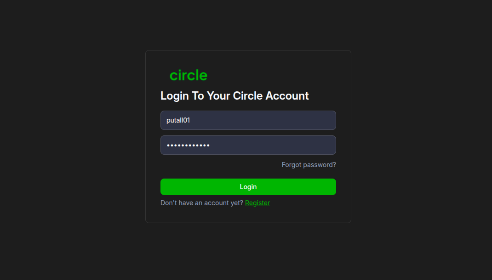
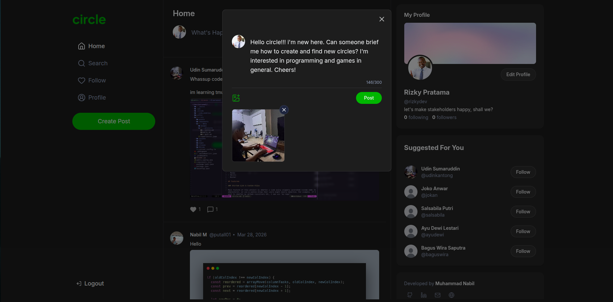
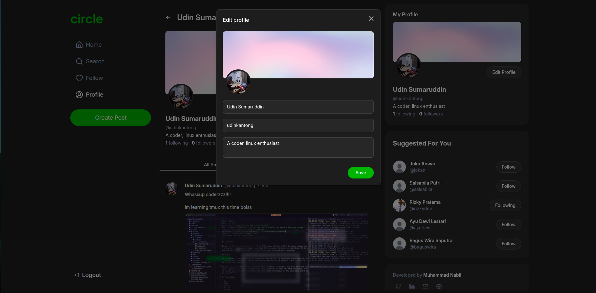
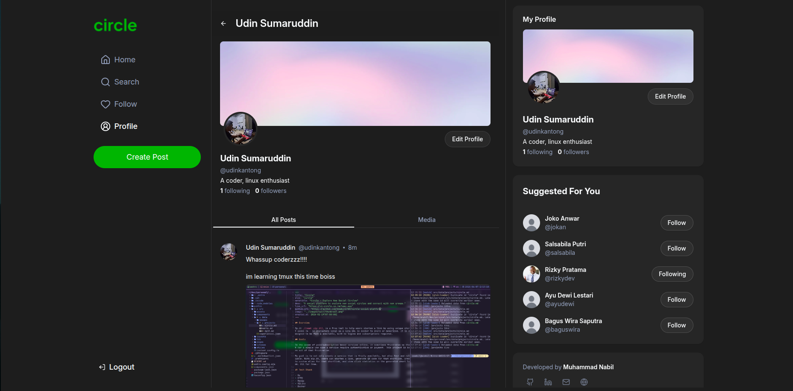
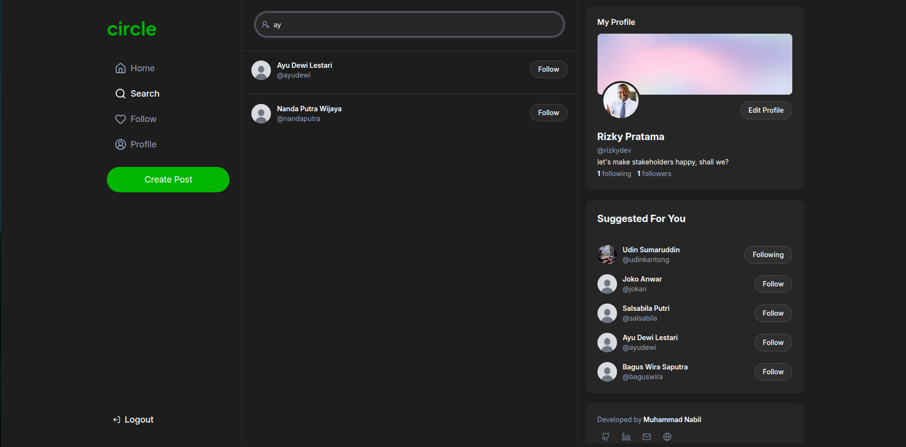
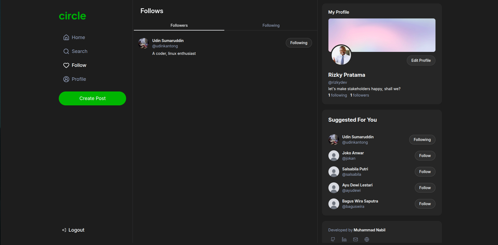

## Overview

Circle is a social media platform that connects people to new social circles. Users can get latest update about what is happening to their connections, reply to them, like their posts, and follow new people. Everything happens in real time.

## Goals

I choose this project because I want to learn how instant real-time update works in web, without page refresh. Since like and follow features in social media often happens in an instant, I think this will be a great opportunity for me to learn about it using [web socket](https://websocket.org).

Other than that, this is also an opportunity for me to apply my knowledge of [Express.js](https://expressjs.com) since this project offers many feature that I have not been able to try, i.e: authentication, image upload, post and replies, also like & follow system.

## Tech Stack

- React.js
- Express.js
- Redis
- Socket.io

## Features

### Authentication

Users may log in to their account by providing username/email and password. If they have not register, they may do so in the registration page. Under the hood, authentication mechanism used in this project is Json Web Token (JWT), which is lightweight and stateless, suitable for large scalable applications.

### Write Post & Replies

User can write a new post, usually contain what they want to say about things, or latest update on something they want to share. They cna also write a reply to somebody elses post. Along with that, they can also upload an image along with their posts and replies.

### Profiles

User can edit their profile: add photo profile, change username, email, and write their short biography. This will also be reflected when other users visit their profile.

### Search

Users can also search other people using their name or username.

### Likes & Follows

User can also like a post or reply they like. Other than that, they can also follow/unfollow other people. To me these features are the most interesting part, because I get to learn how to update a state of my website in real time using web socket. This also give users an instant experience as they like or follow, which is crucial in a social media platform.

## Challenges

Although this is my first time implementing web socket, the real challenges for me comes from state management. This is the first time I need to implement optimistic update, where we _assume_ async operation always succeed. Until they don't. So I also need to "rollback" state in case operations failed.

On the other hand, I keep separate lists of posts as application state. Since we use real time updates for like counts, new post added, profile updates, I need to sync up those changes to multiple of these lists, making it a complex problem yet so much fun to solve.

What I did was to utilize helper functions specifically to update particular post in-place in the state, abstracting away state changes management.

## Lessons

This project is really a stepping stone for me to learn real time update and complex state management. Eventhough this is my first time implementing web socket, it went rather seamless.

I think most of the development time actually comes from managing error handling and syncing server response across states, which is leaning toward a search algorithm problem. But overall, this is a fun project with fun problems to solve.
