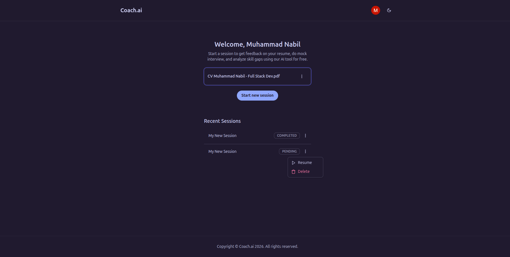
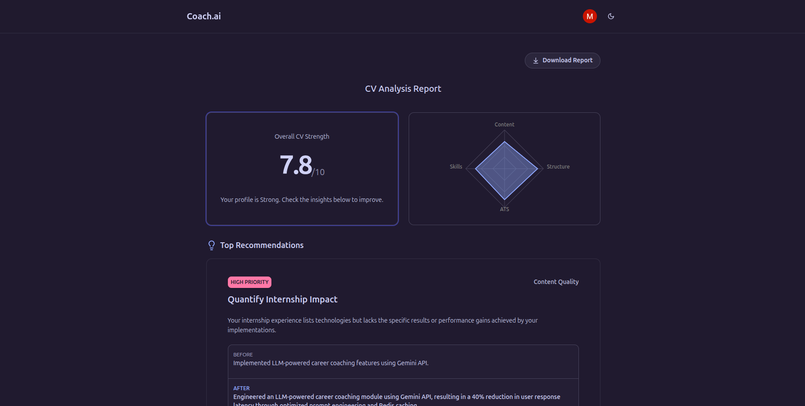
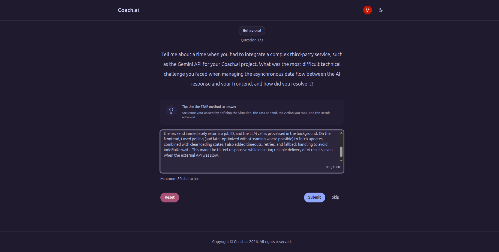
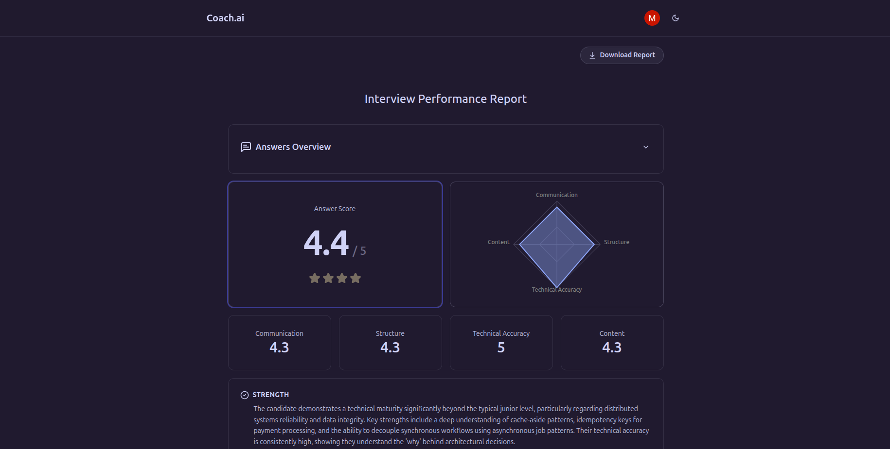
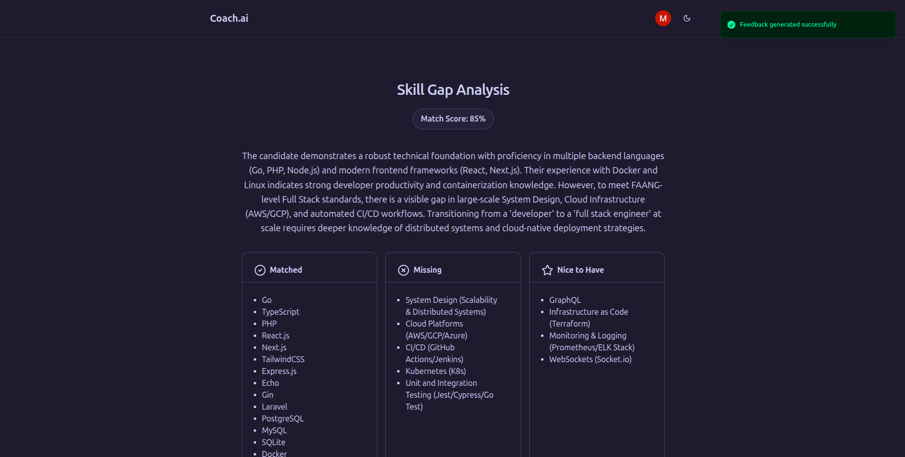

## Overview

Coach.ai is a free AI personal career coaching platform for job seekers. There are 3 main features coach.ai offers: CV review, mock job interview, and skill gap analysis.

## Goals

This project is a really good starting point for me to integrate generative AI into a web applciation. I learned a lot about how to structure LLm output into data structure that our app can process or display.

For public users, especially job seekers, this platform can be a starting point to start preparing their documents and skill set for any position they aspire to be, whether they want to change or start their career.

## Tech Stack

- Next.js
- Supabase
- Gemini API

## Features

### CV Review

To start a coaching session, user need to upload their CV for our system to review it's content and structure. Our AI service then will be able to output a feedback based on 4 criteria: skills, content, structure, and ATS compatibility, along with changes recommendation.

On the dashboard page, user will see their session coaching history, and will be able to resume one if they are not done.

### Mock Interview

For this section, user will need to input their desired position and level or qualification. The system will then generate 3 questions for interview exercise and user can answer those questions, preferrably using STARR method. At the very end, user can see their overall feedback and performance of their interview session.

### Skill Gap Analysis

User can also do analysis on their gaps based on job position input. The system then output list of skill gaps, and recommended resources and roadmap to fill those gaps.

## Challenges

The main challenge in this project is to transform the output of the LLM into our suitable shape and needs. But the drawback really is the response time of the LLM as it is dependant on factors like: model used, latency, output token size, and so on.

The other major challenge I had to face was to create a dynamic routing mechanism to route user to their last progress of their coaching session. For example: if they quit coaching session in the middle of a mock interview, and decided to resume some other time, user will be directed to their last checkpoint of their interview. The solution was to create a step decider component that will handle what component/page to display to user based on their session `step` key in the database.

## Lessons

This project is a starting point for me to integrate AI capabilities into my web application and I learned a lot about structured output of LLMs and how to deal with dynamic routing component.
