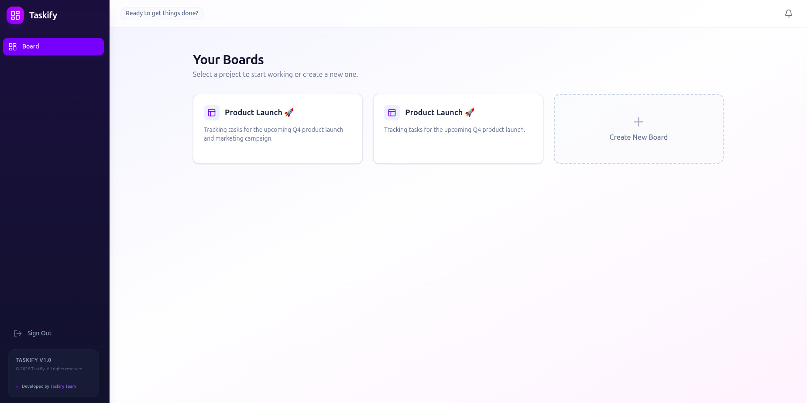
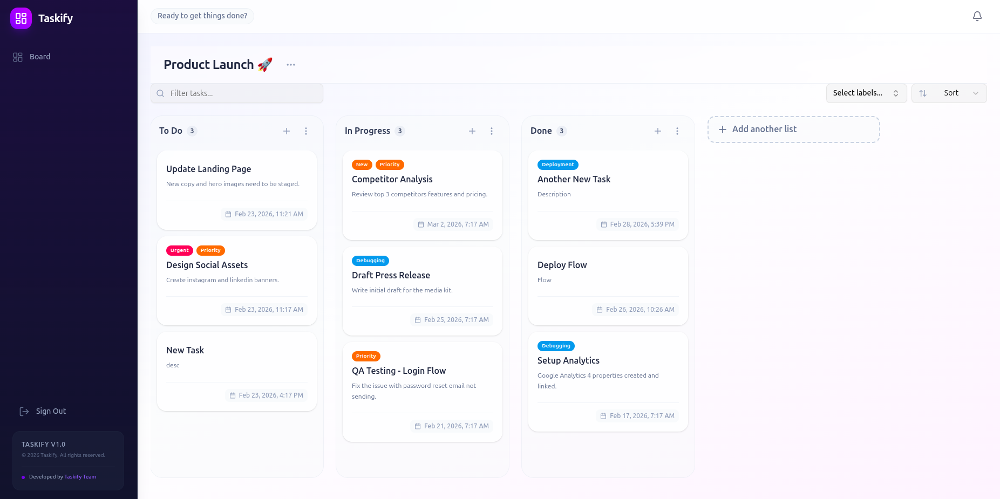
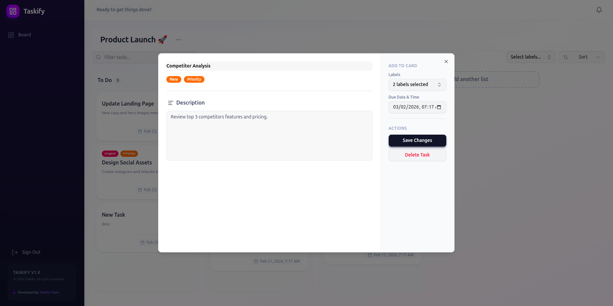
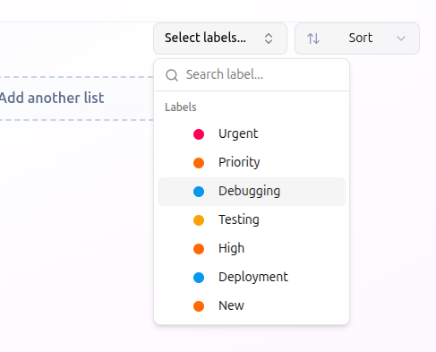
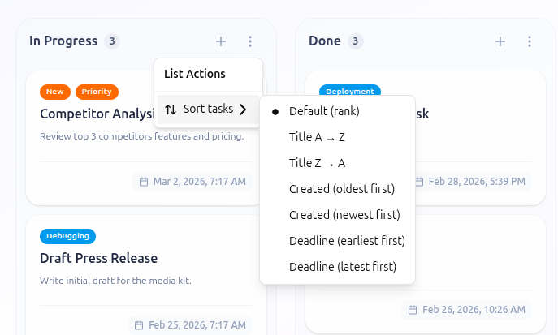
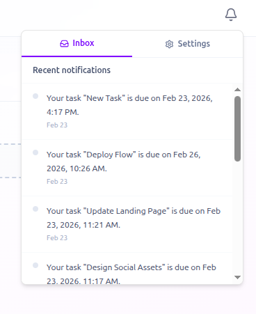
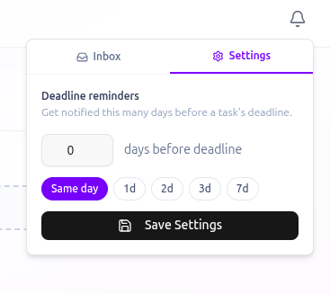

## Overview

Taskify is a kanban board web application to organize and sort tasks. As the name indicated, users can organize their tasks in a [kanban board](https://www.atlassian.com/agile/kanban/boards). Inside the board, they can drag and drop tasks into labeled columns to indicate progress. Kanban board is widely used in an agile framework.

## Goals

This project is delivered as a free simple solutions for people who want to start using kanban board to manage and organize their tasks. Taskify features drag and drop tasks, advanced filtering and sorting, and real time deadline notification.

Alongside above reasons, this project also serves as a learning step for me and my teammate [@Riza-FP](https://github.com/Riza-FP) to learn drag and drop functionality, real time notification changes, and efficiently stores data without explicit trigger or button click.

## Tech Stack

- Next.js
- Express.js
- Supabase

## Features

### Boards

Users can manage their boards, conventionally a kanban board is used for one project. Within boards menu, users can add new board, go into their existing ones, or delete one.

### Drag & Drop

Inside a board, users will be presented with default pre-made lists: to do, in progress, and done. But other than that, users my freely add or delete lists. List contain zero or more tasks and represent a state/stage in the project.

Users can move task to another list via a drag & drop gesture. This is usually done when a task has move to a different stage of the project, or vice cersa.

### Tasks

The smallest building block of a kanban board, a task may contain title, description, labels, and deadline. Users may only create, edit, and delete tasks inside a list.

### Filters & Sorts

One of the most frequently used feature of taskify is filters and sorts, which works to organize tasks both on board level and list level.

- On board level, users can filter tasks by title and labels. Users can also sort tasks alphabetically and by deadlines.
- On list level, users can sort tasks alphabetically, by date they are created at, or deadline.

### Real Time Upcoming Deadline Notification

Also one of the most useful feature is deadline notification, which will send a notification of any upcoming deadline in the near future. It will appear as toasts in the app, as well as a list in notification inbox.

Users my also set when the notification should be sent e.g. in 24 hours before the deadline, 3 days before the deadline, and so on.

## Challenges

From the frontend perspective, the main challenge was working with drag & drop interactivity. We did use [React DnD Toolkit](https://react-dnd.github.io/react-dnd/about), which takes care of drag & drop animation and event listening under the hood. On each event listener we then need to calculate the position of moved tasks and sync with backend.

From the backend perspective, we look for a way to efficiently calculate new positions when users move tasks between lists, or evne just re-ordering the tasks. Using ordinary integer number for unique position is not plausible, because for any re-order you would have to update the position other tasks in the list as well.

We initially looked into [fractional indexing](https://vlcn.io/blog/fractional-indexing), in which a new inserted task will be assigned a new position of `prevPosition + nextPosition / 2`. This also mean that the position column needs to accomodate decimal number (float).

Fractional indexing allows us to only update the position of the task that is being moved, without updating other tasks in a list but is quickly exhaustive. Imagine 2 tasks, task A (position: 1) and task B (position: 2).

- Insert task C between task A and B, update position C: 1.5
- Re-order A between B and C, update position A: 1.75
- Re-order B between A and C, update position B: 1.825
- Re-order C between A and B, update position C: 1.8875

As you can see, the updated position quickly becomes smaller for every re-order and will overflow float data type.

So in the end, we settled with [Lexorank Algorithm](https://medium.com/whisperarts/lexorank-what-are-they-and-how-to-use-them-for-efficient-list-sorting-a48fc4e7849f) which was developed by [Jira](https://www.atlassian.com/software/jira) to handle their rank system that scale. In a nutshell, they use lexixal string system to calculate new position and this is great because it does not becomes exhaustive fast, so we only need to re-balance the ranks for longer period.

## Lessons

This project provides interesting challenges that we as a team needs to overcome, from web canvas drag and drop to ranking system that scales. It definitely teaches us that system performance and efficiency needs to increase linearly with data scale.

## Acknowledgments

- Riza Fauzan Pratama [@Riza-FP](https://github.com/Riza-FP)
