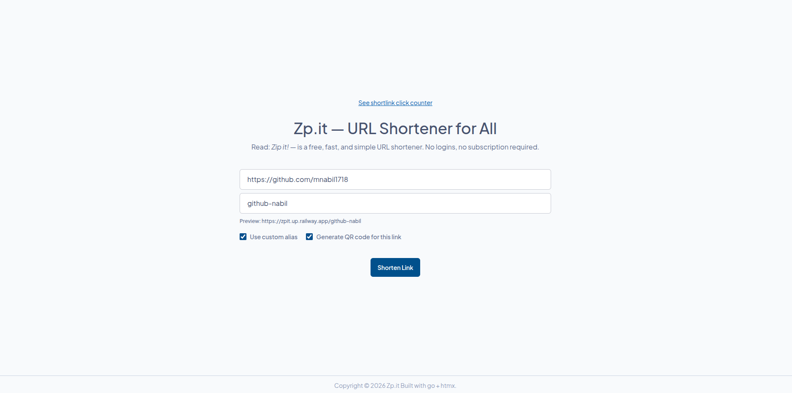
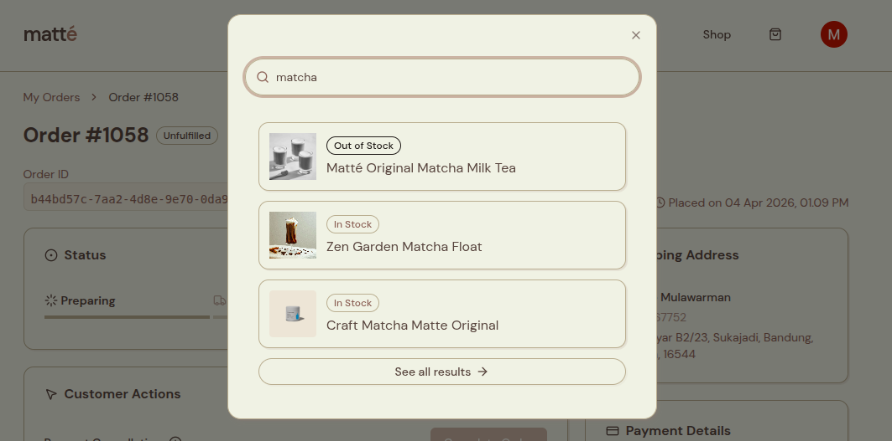
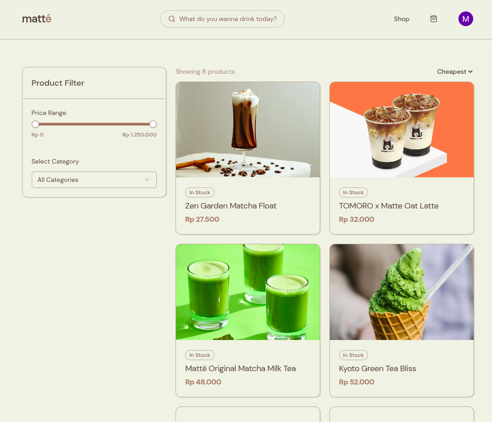
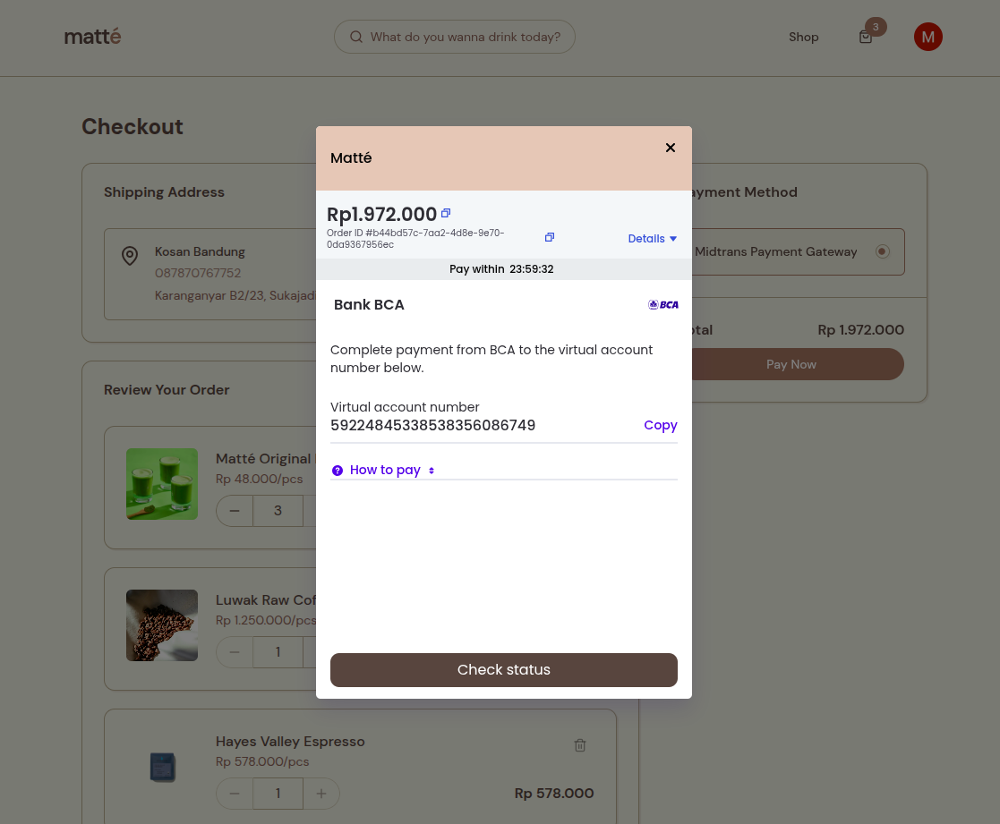
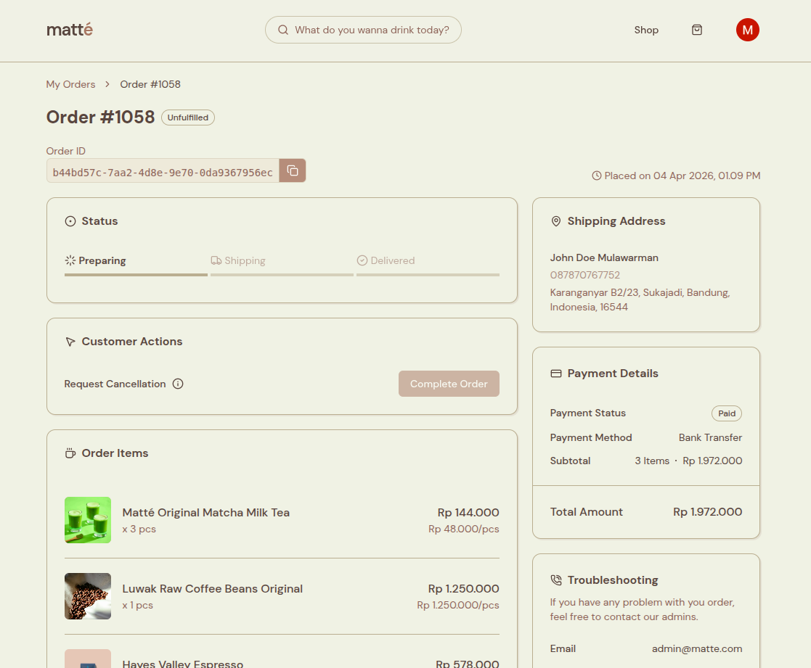
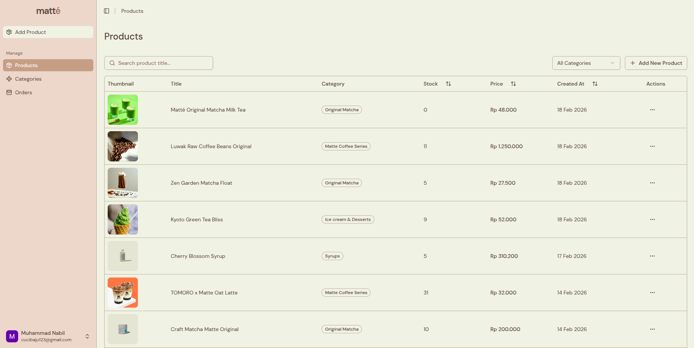
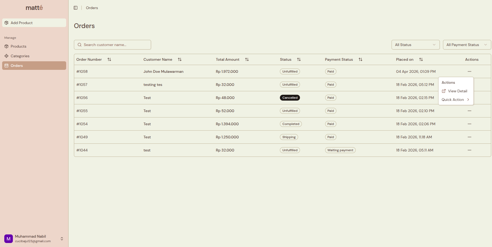

## Overview

Zp.it _(read: zip it)_ is a free tool to help users shorten a link by using unique short codes (6 - 12 characters long) so a long URL is easier to share or memorized. It is designed to be fast & available, with no logins and subscriptions required.

## Goals

In the ocean of paid/subscription based services online, it sometimes frustrates me that for a simple use case a service require authentication or payment. This project is born out of that frustration.

My goal is to not only create a service that is freely available, but also fast and reliable. With zip.it, users can shorten a link, generate QR code for that shortlink, create custom alias for that shortlink, and view click statistics on the generated short link. All for free.

## Tech Stack

- Go
- HTMX
- Redis
- SQLite
- Docker

## Features

### Shorten Link & Custom Alias

Main feature of this project is shorten a link using uniquely generated random code (6 characters), or use a custom alias that users might easily memorize. For example, if I want to shorten my github repository URL, I can use "my-repo".

The unique short code generated by the backend uses go's standard library `crypto/rand` package to generate random integer based of alphabetical characters set. The length of the code can be specified as function parameter.

### Product Live Search & Filters

Customer can use live search feature from the navigation bar to quickly search product name and view the product detail. If they want more control over the filters, like filtering different categories and price ranges, as well as sorting the results based on date and prices, they can go to the catalogue page and adjust the filters there.

### Payment Gateway Integration

For seamless payment experience, we integrated <a href="https://midtrans.com" target="_blank" rel="noopener">Midtrans</a> payment gateway. This method lets customer choose their preferred payment method from an array of various methods provided by Midtrans.

From a technical point of view, this is also a great way to offload payment data and payload to 3rd party services with tested security and reliability. What is also great about Midtrans is that it lets us integrate end-to-end payment flow via <a href="https://docs.midtrans.com/docs/snap" target="_blank" rel="noopener">Midtrans Snap UI</a> which we can embed in our page. To receive update about the payment status, we just need to provide a <a href="https://docs.github.com/en/webhooks/about-webhooks" target="_blank" rel="noopener">Webhook</a> in our backend endpoint.

### Customer Order Detail & Tracking

After an order has been placed, customer can view the detail of their order and track the status changes in real time. They can also request order cancellation for certain reason, but this can only be done before the item is shipped/sent. An administrator can then confirm if the cancellation is eligible or reject if it is not.

Under the hood, the status changes to order status and payment status is done using web socket, specifically using <a href="https://supabase.com/docs/guides/realtime" target="_blank" rel="noopener">Supabase Realtime Database</a> to listen to row changes in real time.

### Admin Features

This project also provided administrator with a content management platform and inventory manager where they can manage products and their stocks, categories, and customer orders. Real time features is implemented in areas such as product stock updates and order status changes. Both are implemented via Supabase Realtime feature.

## Challenges

I would say the most challenging part for me was dealing with Row Level Security (RLS) from Supabase, since this is the first time I'm working with Supabase. Every table needs to have atleast a CRUD RLS policy.

The pain points comes from dealing with nested joins on query because each table might have different RLS policies, thus for more fine-grained control you would want to use a more elevated privilege, like root/administrator access client. But to use this, you must restrict the usage only for queries that need elevated privileges, like querying data for admins.

## Lessons

This project is a great learning milestone for me because I learned a lot about react and next.js in general. From data fetching best practices, abstracting away service functions, using global axios instance, async functions with <a target="_blank" rel="noopener" href="https://github.com/pmndrs/zustand">zustand</a>, even realtime features using supabase.

Considering this is also my first time using supabase, which uses PostgreSQL under the hood, I realized I really know so much about this amazing open source database and it really is one of the most feature-rich database to date.
