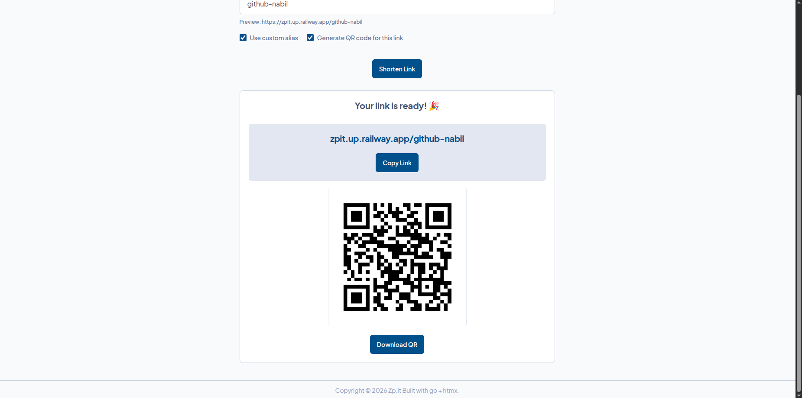
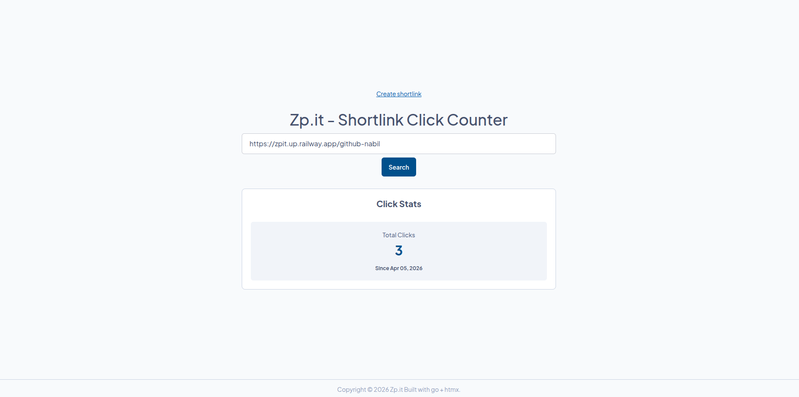

## Overview

Zp.it _(read: zip it)_ is a free tool to help users shorten a link by using unique short codes (6 - 12 characters long) so a long URL is easier to share or memorized. It is designed to be fast & available, with no logins and subscriptions required.

## Goals

In the ocean of paid/subscription based services online, it sometimes frustrates me that for a simple use case a service require authentication or payment. This project is born out of that frustration.

My goal is to not only create a service that is freely available, but also fast and reliable. With zip.it, users can shorten a link, generate QR code for that shortlink, create custom alias for that shortlink, and view click statistics on the generated short link. All for free.

## Tech Stack

- Go
- HTMX
- Redis
- SQLite
- Docker

## Features

### Shorten Link & Custom Alias

Main feature of this project is shorten a link using uniquely generated random code (6 characters), or use a custom alias that users might easily memorize. For example, if I want to shorten my github repository URL, I can use "my-repo".

The unique short code generated by the backend uses go's standard library [crypto/rand](https://pkg.go.dev/crypto/rand) package to generate random integer based of alphabetical characters set. The length of the code can be specified as function parameter.

### QR Code Generation

This project also includes optional QR code generator for users to download the QR code for further sharing. The site will produce 512x512 pixels QR code in PNG format using [github.com/skip2/go-qrcode](github.com/skip2/go-qrcode) package.

### Shortlink Click Counter

Shortlink produced implement a simple click counter statistic to track how many times the link is visited via Zp.it redirection. For performance optimization, database update is performed once per certain time period on a background job.

## Challenges

Since this is a fairly simple and not uncommon project, I need to pick a certain aspect to stand out from other URL shortener. Since this project is built with Go, I decided to maintain the redirection performance optimal, under 100ms latency.

To keep optimal performance, there is a lot of factors at play that I have to look into: from database config & table schema, caching strategy, and infrastructure.

1. Since SQlite is a file based database, there can be only one writer for multiple requests, but we can optimize it to utilize multiple readers using Write-Ahead Logging (WAL) option. Using WAL we also make the reader and writer non-blocking which can fasten queries significantly.
2. For redirection endpoint I use redis caching to mantain a lookup table for URL and short code pair. This helps offload workloads to cache layer and reduce latency.
3. For every redirection, click counter won't directly update the database as it can cause increased latency at scale. Instead, click counts are temporarily stored in cache using a separate goroutine. Another background goroutine (scheduled to run every 20 seconds) then picks up click counts accumulated and sync up the results with main SQLite database.
4. I use [Railway](railway.com) for deployment servers. To reduce latency to its lowest, I picked region that is the closest to my customers base in Indonesia, which is Singapore.

The result is a consistent sub-second latency with average of ~100ms for redirection endpoint, and click count lookup.

## Lessons

I learned a lot about optimization and how to push your system to keep performance optimal & consistent. Turns out, there's a lot of aspect at play to keep a system optimal: database configuration, queries, caching, and even server location.

Going forward when the application load scales, I think I need to rethink my strategy to tune the performance further because it will becomes a real challenge when production data and traffic spikes up.
